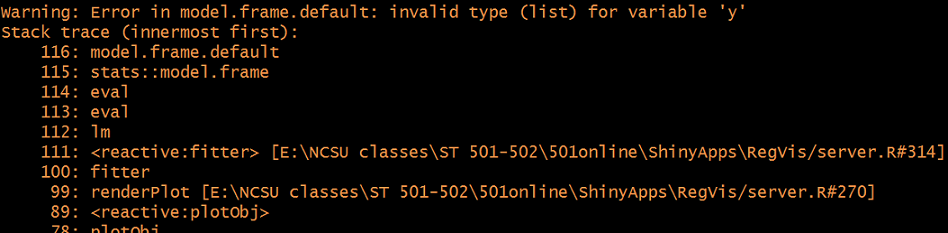

```{r setup, echo = FALSE, message = FALSE, warning = FALSE}
library(dplyr)
options(dplyr.print_min = 5)
library(knitr)
library(readr)
library(plotly)
library(DT)
opts_chunk$set(echo = FALSE)
```

## Recap  
`ui.r`   

  - Controls layout of app (can use standard layouts or customize)  
  - Use strings, formatted (html style) text, widgets (`*Input` functions), and output from `server.r`  (`*Output` functions)  
  - Separate items with commas  
  - Update inputs, render HTML reactively, conditionally show input  
  
`server.r`  

  - Back-end for app  
  - Create outputs that react to inputs (`render*` functions)  
  - To respond to input, must be in a reactive context  
  - Code can be included prior to `shinyServer()`  
  

## Sharing App  
  - Running App locally ties up your system  
  - Others can't access it!  
  - Can host as a URL on a shiny server  
  - Can host apps on [shinyapps.io (powered by RStudio)](https://shiny.rstudio.com/articles/shinyapps.html)    
    + Free, but number of connects and hours limited  
    + Gives stats about usage  
    + Integrated into R Studio  

     


##  Sharing App

 - Can host files on gitHub and run locally from there using  
 
 `shiny::runGitHub("<your repository name>", "<your user name>")`  
 
 - Can host at a URL and run using `shiny::runURL("<the weblink>")`  
 
 - More info about hosting via a URL or just posting files [here](https://shiny.rstudio.com/tutorial/written-tutorial/lesson7/)


##  Useful Things (Static Code)

Code can be placed prior to shinyServer

```{r common-code,eval=FALSE,echo=TRUE}
## Code here that you only need to evaluate once.
## This can include reading in data, creation of 
##      functions common to all sessions, and 
##      reading of other common r scripts. 

shinyServer(function(input, output) {
  
## Code here that can be reactive.  Differs for 
##      every instance of your app that runs.

})
```


##  Useful Things (Static Code)

**Including Other Files**  
```{r include-files, eval=F,echo=TRUE}
##  top of server.R, output from here is common to all users

#data set only read in once
dat <- read_csv("dataset.csv")

#function created and not modified
helper <- function(item1, item2) {item1 + item2}

shinyServer(function(input, output) {
  ## reactive things, instance of app dependent
})
```


##  Useful Things (Static Code)

**Including Other Files**  

If you have a lot of code, you can read in a separate script   


##  Useful Things (Static Code)

**Including Other Files**  

If you have a lot of code, you can read in a separate script   

 - If external script is `helpers.R` in same folder as app:  
 
```{r source, eval=F,echo=TRUE}
##  top of server.R
source("helpers.R")

shinyServer(function(input, output) {
  ##  do stuff
})
```  


## Improve Efficiency 

  - Can use `isolate()` to improve code efficiency  
```{r isolate,echo=TRUE,eval=FALSE}
renderPlot({
         input$submit  # Do take a dependency on input$submit
         hist(data, breaks = isolate(input$slider)) #don't depend on slider
})
```

## Missing data or object  

- Used to need to check if data/object existed and return `NULL` from your `render*` function  

- Now can use `req()` to check (see [this page](https://shiny.rstudio.com/articles/req.html) for more info)

```{r, echo = TRUE, eval = FALSE}
data <- reactive({
  req("input$dist")
  if(input$dist == "norm"){
    dataVals <- rnorm(100)
  } else if (input$dist == "unif"){
    dataVals <- runif(100)
  }
})

output$plot <- renderPlot({
  hist(data())
})
```

## More Interactive Plots & Math  

  - Improved plots with `plotly` package!  
  - [plotly example](http://shiny.stat.ncsu.edu/jbpost2/Transform/)  
  

## More Interactive Plots & Math  

  - Improved plots with `plotly` package!  
  - [plotly example](http://shiny.stat.ncsu.edu/jbpost2/Transform/)  
  
  - Can add in Latex easily!  
  
  - Include `withMathJax()` as a UI argument   

  - Calls in javascript that will replace Latex source code  

```{r withMathJax,echo=TRUE,eval=FALSE}
fluidRow(
    #add in latex functionality if needed
    withMathJax(),
          ...
```


## Other Useful Things  

  - Create "dashboards" with `shinydashboard` package  
  
  - Alternatively can use `flexdashboard` (doesn't use bootstrap 3 but css flexbox layout)  
  

## Other Useful Things  

  - Create "dashboards" with `shinydashboard` package  
  
  - Alternatively can use `flexdashboard` (doesn't use bootstrap 3 but css flexbox layout)  
  
&nbsp;  &nbsp;    
 
  - Use mouse over and click inputs    
  - [Click Input Example](http://shiny.stat.ncsu.edu/jbpost2/BasketballCharting)
  
  
## Other Useful Things  

  - Create "dashboards" with `shinydashboard` package  
  
  - Alternatively can use `flexdashboard` (doesn't use bootstrap 3 but css flexbox layout)  
  
&nbsp;  &nbsp;    
 
  - Use mouse over and click inputs    
  - [Click Input Example](http://shiny.stat.ncsu.edu/jbpost2/BasketballCharting)
  
&nbsp;  &nbsp;  

 - Include Shiny in your Markdown slides!  
 - Use ioslides and add `runtime: shiny`

  
## Other Useful Things  

  - [shinythemes](https://rstudio.github.io/shinythemes/) are available  
  - [shinyjs package](https://github.com/daattali/shinyjs) adds more functionality  
  - List of [all functions](https://shiny.rstudio.com/reference/shiny/latest/) for the UI and server  
  - Lots of good tutorials!  
    + See weekly overview  
  - [R Shiny Cheat Sheet](http://shiny.rstudio.com/images/shiny-cheatsheet.pdf)


## Debugging  

  - Much harder in shiny!  
  
  - [Shiny debugging page](https://shiny.rstudio.com/articles/debugging.html)  

  - Recommendation: Get static working code, then transfer to shiny  


## Debugging

  - Can use `observe({print(...)})`  

```{r,echo=TRUE,eval=FALSE}
shinyServer(function(input,output){

  #would now print to console
  observe({print(input$NI + 10)})

}
```  

## Debugging  

Three major approaches:  

  1. Breakpoints - Pausing execution of your program

  2. Tracing - Collecting information as your program runs

  3. Error handling - Finding the source of errors (both on the client and server side) and ascertaining their cause.  
  
## Breakpoints  
  - Can be used in `server.r`  
  - Click to the left of the line number  
    

 > - Now can access values and step through program  

 > - Can also use browser()
  
## Tracing  
  - Can run apps in ['showcase mode'](http://shiny.rstudio.com/gallery/kmeans-example.html)      
  - Invoke your app with the code below  
  
```{r,echo=TRUE,eval=FALSE}
shiny::runApp(app, display.mode="showcase")
```

  - Also a reactive log that can be viewed  
  
## Error Handling  
  - Check stack trace shiny returns

  

## Enter Debug Mode on Error  
  - Can make Shiny enter the debugger when an error occurs by using the following statement:  

```{r,echo=TRUE,eval=FALSE}
options(shiny.error = browser)
```  

  - Overall, experience helps!    
  

##  Recap  

- Shiny a great way to share results  

- `ui.R` and `server.R` files or one file using `app.R`  

- Reactive contexts important  

- Can make UI dynamic  

- Deploy in multiple ways  

- Lots of add-ons/packages to make things nicer  

- Debugging can be tricky, best to make static code work first!  
