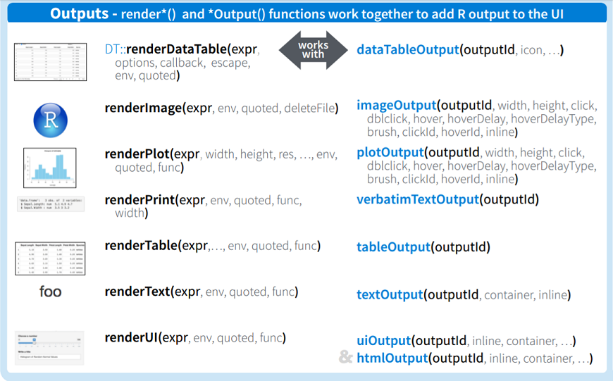

```{r setup, echo = FALSE, message = FALSE, warning = FALSE}
library(dplyr)
options(dplyr.print_min = 5)
library(knitr)
library(readr)
library(plotly)
library(DT)
opts_chunk$set(echo = FALSE)
```

## Summary So Far   
`ui.r`     

  - Controls layout of app    

  - Basic layout uses a sidebar panel and a main panel    

  - Use strings, formatted (html style) text, widgets (`*Input` functions), and output from `server.r`  (`*Output` functions)    

  - Separate items with commas      


## Server file  
`server.r` also called the 'back-end' because it works behind-the-scenes; its actions are not directly visible

```{r server-basics, eval=FALSE,echo=TRUE}
## set up server
shinyServer(function(input, output, session) {
  # add stuff
})
```


## Server file  
`server.r` also called the 'back-end' because it works behind-the-scenes

```{r server-basics2, eval=FALSE,echo=TRUE}
## set up server
shinyServer(function(input, output, session) {
  # add stuff
})
```

The arguments for the server are `input`, `output`, and `session`.  Allow us to    

  1. Take in inputs from the UI        
  
  2. Run functions on them     
  
  3. Create outputs to send back     
  

## Creating Output to Send to UI  
  


## Creating Output to Send to UI
Example syntax
```{r server-syntax,echo=TRUE,eval=FALSE}
shinyServer(function(input,output){
  output$nameOfOutputObject <- renderPlot(
    #code that will return a plot
  )
  
  output$otherOutput <- renderText(
    #code that will return something that R can coerce to a string
  )
})

#in ui.r file, reference would look like
plotOutput("nameOfOutputObject")
textOutput("otherOutput")
```

## Accessing Input Values in server.R
 - Every input object has an `inputId`


## Accessing Input Values in server.R
 - Every input object has an `inputId`
 - In `server.r`, reference input value by
```{r input-ref,echo=TRUE,eval=FALSE}
input$inputId
```


## Accessing Input Values in server.R
 - Every input object has an `inputId`
 - In `server.r`, reference input value by
```{r input-ref2,echo=TRUE,eval=FALSE}
input$inputId
```
 - Example
```{r input-ref-ex,echo=TRUE,eval=FALSE}
#input widget code from ui.r file
sliderInput(inputId = "slide",label = "Select the Range Here",min = 0,max = 1,
            value = c(0,1))
#reference in server.r might look like
output$userPlot<-renderPlot({
  range<-input$slide
  #create plot that changes based on user input
  plot(data,xlim=range)  
})
```  


## Input and Output  
 -  `input` and `output` objects are kind of like **lists**  
 -  Shiny passes the information back and forth through them  


## Input and Output  
 -  `input` and `output` objects are kind of like **lists**  
 -  Shiny passes the information back and forth through them  
 -  Notice how we name our output objects  
```{r naming,echo=TRUE,eval=FALSE}
output$nameOfOutputObject <- renderPlot(...)  
```    


## Input and Output  
 -  `input` and `output` objects are kind of like **lists**  
 -  Shiny passes the information back and forth through them  
 -  Notice how we name our output objects  
```{r naming2,echo=TRUE,eval=FALSE}
output$nameOfOutputObject <- renderPlot(...)  
```    
 - Notice how we access our inputs
```{r accessing,echo=TRUE,eval=FALSE}
output$nameOfOutputObject <- renderPlot(
   range <- input$slide
   ...
)  
```    


## Quick Try  

- Using the template app  

- Add text output object in the `server.R` file (use `renderText()`) that returns the current value of the input slider   

- To do this, just reference the input (like an R function, it will return the last thing you do)  

- Add a `textOutput()` in the `ui.R` file!  


## Reactivity  
 - Output objects do not have to depend on an input    

 - Those that don't will be static    
 
> - Any 'chunk' of code in `server.r` that references a user input must be **reactive**   

> - When a user changes an input the `input$` value associated invalidates and causes appropriate chunks of code to **re-evaluate** in the server  

## Example Reactivity
```{r reactivity,echo=TRUE,eval=FALSE}

##code chunk "reacts" to and re-evaluates if 
##input$sampleSize or input$otherInput changes 

output$dataPlot <- renderPlot({

  n <- input$sampleSize
  input$otherInput #not used anywhere else, but entire   
                   #renderPlot chunk still re-evaluates
                   #if changed
  
  hist(rbinom(n = 1, size = n, prob = 0.4))
  
})
```

- type `shiny::runExample("01_hello")` into the console


## Reactivity  

- `server.r` can run any R code, but can't access inputs unless put into a reactive context     

- All `render*` functions are reactive contexts    

 
## Error Using Reactive Variables  
Following returns the error:

```{r bad-reactivity,echo=TRUE,eval=FALSE}
shinyApp(ui <- fluidPage(
                numericInput("NI", "Give me a number", value = 10),
                textOutput("string")
                ),
         
         shinyServer(function(input, output){
                print(input$NI + 10)
                output$string <- renderText(paste("value plus 10 is", input$NI + 10))
         }
))
```
Warning: Error in .getReactiveEnvironment()$currentContext: Operation not allowed without an active reactive context. (You tried to do something that can only be done from inside a reactive expression or observer.)  


## Other Reactive Contexts  

- `reactive({})` creates a reactive context and allows for the creation of a new variable  

- `reactiveValues({})` similar to `reactive` but is easier to create multiple items  

- `observe({})` function allows for reactivity and reevaluation of code  

- `observeEvent({})` similar to observe but allows for more control  

- `eventReactive({})` similar to `observeEvent()` but you can return something like `reactive()` does  
 
## More on `reactive({})`

  - 'Wraps' a normal expression to create a reactive expression (code user can cause to change)     
  
 > - Can read reactive values and call other reactive expressions    
 
 > - Only re-evaluates *if necessary*    
 
 > - Usually used to save something you'll call in multiple other places  
 
 > - Access object as though calling it as a function  


## More on `reactive({})`

- Access object as though calling it as a function  
  
```{r reactive,echo=TRUE,eval=FALSE}
shinyServer(function(input,output){
  #Creates a new reactive variable
  newVar <- reactive({
    value <- c(input$NI + 10, input$NI * 3)
  })

  output$textString <- renderText({
    value <- newVar()  #access like a function!
    paste0("Input plus 10 is ", value[1], " and Input times 3 is ", value[2])
  })
  
  output$otherString <- renderText({
  	value <- newVar()
  	paste0(value[1], ",", value[2])
  })
})
```


## `reactiveValues()`  

- Create list like object with `reactiveValues()`  

- Access elements via `$` 

- Elements can be changed in a reactive context    

```{r reactiveValues,echo=TRUE,eval=FALSE}
shinyServer(function(input,output){
  #Creates a new reactive values
  vals <- reactiveValues(data = rnorm(150), initial = 0)

  output$textString <- renderText({
    paste0("The value of initial is ", vals$initial)
  })
  
  output$hist <- renderPlot({
    hist(vals$data)
  })
})
```

## `observe({})`  

  - Can read reactive values and call reactive expressions    
  
>  - *Automatically* re-execute when any dependencies change    

>  - Doesn't yield a result - just re-executes the code

```{r correct-reactivity,echo=TRUE,eval=FALSE}
shinyServer(function(input,output){
  #would now print to console
  observe({print(input$NI+10)})

	#update UI
	observe({
		input$noPitch
		updateCheckboxGroupInput(session, "pitchTypeChoice", selected = c(""))
	})
})
```  

## `observeEvent({})`  

  - Similar to observe but allows for control of dependencies  
  
  - Place explicit dependencies prior to `{}`  
  
  - Useful when writing things to a database or file  

```{r correct-reactivity2,echo=TRUE,eval=FALSE}
shinyServer(function(input,output){
  #would now print to console
  observeEvent(input$NI, {print(input$data)})

	#update UI
	observe({
		input$noPitch
		updateCheckboxGroupInput(session, "pitchTypeChoice", selected = c(""))
	})
})
```  


## `eventReactive()`  

- Similar to `observeEvent()` but returns object similar to `reactive()` (use like a function)  

```{r, echo = TRUE}
shinyServer(function(input,output){
  #would now print to console
  update <- eventReactive(input$submit, {list(gamma = input$gamma, alpha = input$alpha)})

	#update UI
	output$gammaDist <- renderText({
	  paste0("The parameters are ", update())
	})
})
```


## Quick Try  

- Continue building from the template app  

- Add two `numericInput()` elements and an `actionButtion()`  

- Create a `reactive()` object that uses the number inputs and the slider value  

- Use this object in the previous `renderText()` and output a new table (add this in UI as well)  

- Use `observeEvent()` to print something to the console only when the action button is pressed  

- Use `eventReactive()` to change some output only when the action button is pressed


## Developing an App

- **Highly Recommended:** 

Draw out what you want the app to look like    

- Write R code to complete your app in a static manner!  

- Determine dependencies and consider reactive functions to use  

- Translate to appropriate Shiny output functions


## Summary So Far   
`ui.r`    

  - Controls layout of app    
  - Basic layout uses a sidebar panel and a main panel    
  - Use strings, formatted (html style) text, widgets (`*Input` functions), and output from `server.r`  (`*Output` functions)    
  - Separate items with commas      
  
`server.r`    

  - Back-end for app      
  - Create outputs that react to inputs (`render*` functions)      
  - To respond to input, must be in a reactive context      


