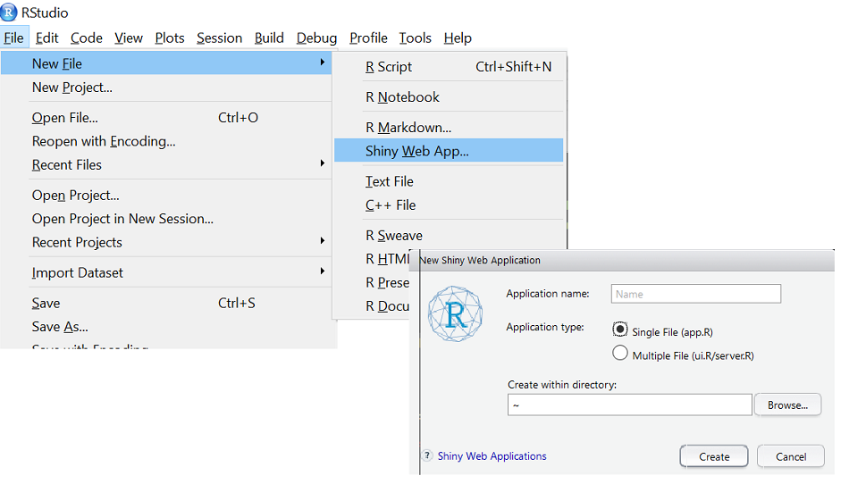

```{r setup, echo = FALSE, message = FALSE, warning = FALSE}
library(shiny)
library(dplyr)
options(dplyr.print_min = 5)
library(knitr)
library(readr)
library(plotly)
library(DT)
opts_chunk$set(echo = FALSE)
```


## Big picture

- Know how to read data in, combine and manipulate it, summarize, and visualize   

    + `tidyverse` great!

- Know how to do some predictive modeling  

    + `caret` is awesome  
    
- Know how to collaborate and communicate code/results  

    + via github and `rmarkdown`  

- Ready to create interactive web applets or dashboards!  

    + Great way to present your data and results for others    


## What is R Shiny?  

- [R Shiny Package](http://shiny.rstudio.com/)  

    + Developed by RStudio  
    + Allows for creation of apps and dashboards  
  
- A .R file (or two) with special code to create an app  
  
    + `ui.R` (User Interface)  
    + `server.R` (R functions that run/respond to UI)
    + `app.R` (both UI and server combined)  

- Requires no HTML, CSS, or JavaScript!

  
## Example App
```{r eruptions}
inputPanel(
  selectInput("n_breaks", label = "Number of bins:",
              choices = c(10, 20, 35, 50), selected = 20),
  
  sliderInput("bw_adjust", label = "Bandwidth adjustment:",
              min = 0.2, max = 2, value = 1, step = 0.2)
)

renderPlot({
  hist(faithful$eruptions, probability = TRUE, breaks = as.numeric(input$n_breaks),
       xlab = "Duration (minutes)", main = "Geyser eruption duration")
  
  dens <- density(faithful$eruptions, adjust = input$bw_adjust)
  lines(dens, col = "blue")
})
```


## How to Develop R Shiny Apps

* Explore online repositories/resources for existing apps  
  
      + Learn capabilities!  

* Learn how to create the user interface (UI)  

* Understand how the server (R) backend works  

* Customize apps    

* Learn solutions to common issues when creating apps and deploy it  


## Available Apps  

- Many available resources!!  
  
- [Shiny Gallery/Showcase](https://shiny.rstudio.com/gallery/)
  
- [Stat Concepts](https://github.com/gastonstat/shiny-introstats/)  

- [More Stat Concepts](https://www.researchgate.net/publication/298786680_Web_Application_Teaching_Tools_for_Statistics_Using_R_and_Shiny)  

- [Even more!](http://www.statistics.calpoly.edu/shiny)

- Take a few minutes to explore some apps if you haven't already!  
  

## Elements of an App
  - Each app has two things
    * User Interface (UI) 
    * Server     

## Elements of an App
  - Each app has two things
    * User Interface (UI) 
    * Server     
    
  - UI determines **layout** of app  
      + Sets up widgets (items users can interact with)  


## Elements of an App
  - Each app has two things
    * User Interface (UI) 
    * Server     
    
  - UI determines **layout** of app  
      + Sets up widgets (items users can interact with)  
  
  - Server contains R code to **run for the app**  
      + Can include plots, model fitting, any R code really...  


## Elements of an App
  - Each app has two things
    * User Interface (UI) 
    * Server     
    
  - UI determines **layout** of app  
      + Sets up widgets (items users can interact with)  
  
  - Server contains R code to **run for the app**  
      + Can include plots, model fitting, any R code really...  
    
  - Can do with single file (`app.R`) but we'll use a separate file (`ui.R` and `server.R`)


## Two File Approach    

 - Create folder for each App you create  

 - Each App's folder should have `ui.R` and `server.R` files  
 
 - (If single file, `app.R` in each folder)   

***  


## `ui.R` Basic Layout
```{r basic-ui,eval=FALSE,echo=TRUE}
library(shiny)

ui <- fluidPage(
	titlePanel(), 
	
  sidebarLayout(
    sidebarPanel(#usually widgets
      ),
    mainPanel(#usually output
      )
  )
)
```


## UI Common Layout  
```{r layout,echo=FALSE}
shinyUI(fluidPage(
  titlePanel("title panel"),

  sidebarLayout(
    sidebarPanel( "sidebar panel",br(),"|",
              br(),"|",br(),"|",br(),"|",br(),"|",br(),"|",br(),"V",br(),"Usually User Inputs"),
    mainPanel("main panel content-------------------->",br(),"|",
              br(),"|",br(),"|",br(),"|        Usually Output",br(),"|        that Reacts to User Input",br(),"|",br(),"V")
  )
))
``` 


## `server.R` Basic File  
```{r basic-server,eval=FALSE,echo=TRUE}
library(shiny)

shinyServer(function(input, output, session) {

})
```  

## Shiny Templates  
Readily available in R studio  
  

## Two File Template
```{r two-file-template-ui,eval=FALSE,echo=TRUE}
library(shiny)
ui <- fluidPage(
   # Application title
   titlePanel("Old Faithful Geyser Data"),
   # Sidebar with a slider input for number of bins 
   sidebarLayout(
      sidebarPanel(
         sliderInput("bins",
                     "Number of bins:",
                     min = 1,
                     max = 50,
                     value = 30)
      ),
      # Show a plot of the generated distribution
      mainPanel(
         plotOutput("distPlot")
      )
   )
)
```

## Two File Template  
```{r two-file-template-server,eval=FALSE,echo=TRUE}
library(shiny)  

# Define server logic required to draw a histogram
server <- function(input, output) {
   output$distPlot <- renderPlot({
      # generate bins based on input$bins from ui.R
      x    <- faithful[, 2] 
      bins <- seq(min(x), max(x), length.out = input$bins + 1)
      
      # draw the histogram with the specified number of bins
      hist(x, breaks = bins, col = 'darkgray', border = 'white')
   })
}
```  

## Running an App  
  - While `ui.R` or `server.R` is your active window, click the **Run App** button  
   
  

## Running an App  
  - While `ui.R` or `server.R` is your active window, click the **Run App** button  
      
  
  - Use `shiny::runApp()` function  
     * ex: `runApp("path/to/ui_or_server_or_app.R")`   


## Running an App  
  - While `ui.R` or `server.R` is your active window, click the **Run App** button  
      
  
  - Use `shiny::runApp()` function  
     * ex: `runApp("path/to/ui_or_server_or_app.R")`   

  - Running App will tie up R console!  
  - End by hitting Esc or closing shiny app  
  
  > - Take a minute and run the template app


## Adding to the UI    
Using a comma to separate items, you can add  

- Any plain strings  
- Widgets  
- Formatted text (using HTML type functions)  
    
- Output from things created in the `server.R` file  
  
  
## Adding to the UI - Widgets  
  - Widgets can be added using their `*Input` functions  
  - Separate widgets (and other items) by commas in ui.R file


## Adding to the UI - Widgets  
  - Widgets can be added using their `*Input` functions  
  - Separate widgets (and other items) by commas in ui.R file
    
  
  
***
<div style="margin-left:-20px; margin-top:-50px; margin-right: -20px; margin-bottom: -50px; height: 100%;">  

```{r widget-app,echo=FALSE,message=FALSE, warning = FALSE}
library(shiny)
library(rvest)

#function to get help file and format
helpFile<-function(site){
  code<-read_html(site)
  title<-html_node(code,"body") %>% html_node("h1") %>% html_text()
  rcode<-html_node(code,"body") %>% html_node("pre")
  args<-html_node(code,"body") %>% html_node("table")
  as.character(paste(paste0("<h3>",title,"</h3>"),"<h4>Usage</h4>",rcode,"<h4>Arguments</h4>",args,sep=" "))
}

# Define UI for application that draws a histogram
shinyApp(
  # Define UI for application that draws a histogram
  ui <- fluidPage(
     # Application title
     titlePanel(h1("Shiny Widgets for the UI")),
     
     # Sidebar with a slider input for number of bins 
     fluidRow(
       column(6,
          fluidRow(
            column(6,selectizeInput("widget", label = h2("Widget"),
                        choices = c("Button","Check Box","Check Box Group","Date Input","Date Range","File Input","Numeric Input","Radio Button","Select Box","Slider","Text Input"), selected = "Button")
           ),
            column(6,
              conditionalPanel(condition="input.widget == 'Button'",actionButton("B",h3("Click Here!"))),
              conditionalPanel(condition="input.widget == 'Check Box'",checkboxInput("CB",label=h3("Add Element"),value=FALSE,width='100%')),
              conditionalPanel(condition="input.widget == 'Check Box Group'",checkboxGroupInput("CBG",h3("Select From the Choices Below"),choices=list("Option A","Option B","Option C","Option D"),width='100%')),
              conditionalPanel(condition="input.widget == 'Date Input'",dateInput("DI",h3("Input a Date Here",style="border-style:outset"),value='2016-11-122')),
              conditionalPanel(condition="input.widget == 'Date Range'",dateRangeInput("DR",h3("Input Dates Here",style="border-style:inset"),start='1983-11-14')),
              conditionalPanel(condition="input.widget == 'File Input'",fileInput("FI",h3("Select File to Input"))),
              conditionalPanel(condition="input.widget == 'Numeric Input'",numericInput("NI",h3("Enter a Number Between 0 and 1000"),value=0,min=0,max=1000,step=5)),
              conditionalPanel(condition="input.widget == 'Radio Button'",radioButtons("RB",h3("Select a Choice Below",style="background-color:lightblue;border-style:dotted"),choices=list("Option A","Option B","Option C","Option D"))),
              conditionalPanel(condition="input.widget == 'Select Box'",selectInput("SB",h3("Select From the Group Below"),choices=list("Option A","Option B","Option C","Option D"),multiple=TRUE)),
              conditionalPanel(condition="input.widget == 'Slider'",sliderInput("S",h3("Use the Slider to Select a Range",style="font-family: Courier New"),min=0, max=1000,value=100,animate=TRUE,step=5)),
              conditionalPanel(condition="input.widget == 'Text Input'",textInput("TI",h3("Write Your Text Below",style="color:blue")))
            )
           ),
          tags$hr(),
          fluidRow(
            column(12,h2("Code Used for Widget Above"),
              verbatimTextOutput("userInput")
            )
          ),
          fluidRow(
            column(12,h2("What does Shiny return for use?"),
              verbatimTextOutput("widgetValue")
            )
          )
       ),
       column(6,h2("Help Information for Widget"),
        uiOutput("widgetInfo")
       )
     )
  ),

    
  # Define server logic required to draw a histogram
  server <- function(input, output,session) {
   
    output$widgetValue<-renderPrint({
      if(input$widget=="Button"){
         list(input$B)
      } else if(input$widget=="Check Box"){
        list(input$CB)
      } else if(input$widget=="Check Box Group"){
        list(input$CBG)
      } else if(input$widget=="Date Input"){
        list(input$DI)
      } else if(input$widget=="Date Range"){
        list(input$DR)
      } else if(input$widget=="File Input"){
        list(input$FI)
      } else if(input$widget=="Numeric Input"){
        list(input$NI)
      } else if(input$widget=="Radio Button"){
        list(input$RB)
      } else if(input$widget=="Select Box"){
        list(input$SB)
      } else if(input$widget=="Slider"){
        list(input$S)
      } else if(input$widget=="Text Input"){
        list(input$TI)
      }
    })
    
  
  output$widgetInfo<-renderText({
      if(input$widget=="Button"){
        helpFile("https://shiny.rstudio.com/reference/shiny/latest/actionButton.html")
      } else if(input$widget=="Check Box"){
        helpFile("https://shiny.rstudio.com/reference/shiny/latest/checkboxInput.html")
      } else if(input$widget=="Check Box Group"){
        helpFile("https://shiny.rstudio.com/reference/shiny/latest/checkboxGroupInput.html")
      } else if(input$widget=="Date Input"){
        helpFile("https://shiny.rstudio.com/reference/shiny/latest/dateInput.html")
      } else if(input$widget=="Date Range"){
        helpFile("https://shiny.rstudio.com/reference/shiny/latest/dateRangeInput.html")
      } else if(input$widget=="File Input"){
        helpFile("https://shiny.rstudio.com/reference/shiny/latest/fileInput.html")
      } else if(input$widget=="Numeric Input"){
        helpFile("https://shiny.rstudio.com/reference/shiny/latest/numericInput.html")
      } else if(input$widget=="Radio Button"){
        helpFile("https://shiny.rstudio.com/reference/shiny/latest/radioButtons.html")
      } else if(input$widget=="Select Box"){
        helpFile("https://shiny.rstudio.com/reference/shiny/latest/selectInput.html")
      } else if(input$widget=="Slider"){
        helpFile("https://shiny.rstudio.com/reference/shiny/latest/sliderInput.html")
      } else if(input$widget=="Text Input"){
        helpFile("https://shiny.rstudio.com/reference/shiny/latest/textInput.html")
      }
    })
  
  output$userInput<-renderText({
    if(input$widget=="Button"){
      'actionButton("B",h3("Click Here!"))'
    } else if(input$widget=="Check Box"){
      'checkboxInput("CB",label=h3("Add Element"),value=FALSE,width="100%")'
    } else if(input$widget == 'Check Box Group'){
      'checkboxGroupInput("CBG",h3("Select From the Choices Below"),choices=list("Option A","Option B","Option C","Option D"),width="100%"))'
    } else if(input$widget == 'Date Input'){
      'dateInput("DI",h3("Input a Date Here",style="border-style:outset"),value="2016-11-122"))'
    } else if(input$widget == 'Date Range'){
      'dateRangeInput("DR",h3("Input Dates Here",style="border-style:inset"),start="1983-11-14"))'
    } else if(input$widget == 'File Input'){
    'fileInput("FI",h3("Select File to Input")))'
    } else if(input$widget == 'Numeric Input'){
      'numericInput("NI",h3("Enter a Number Between 0 and 1000"),value=0,min=0,max=1000,step=5))'
    } else if(input$widget == 'Radio Button'){
    'radioButtons("RB",h3("Select a Choice Below",style="background-color:lightblue;border-style:dotted"),choices=list("Option A","Option B","Option C","Option D")))'
    } else if(input$widget ==  'Select Box'){
      'selectInput("SB",h3("Select From the Group Below"),choices=list("Option A","Option B","Option C","Option D"),multiple=TRUE))'
    } else if(input$widget == 'Slider'){
      'sliderInput("S",h3("Use the Slider to Select a Range",style="font-family: Courier New"),min=0, max=1000,value=100,animate=TRUE,step=5))'
    } else if(input$widget == 'Text Input'){
      'textInput("TI",h3("Write Your Text Below",style="color:blue"))'
    }
  })
  }
)
```  

</div>

## HTML tags  

Adding Formatted Text via HTML   

    - Showed tags with helper functions - many more (use `shiny::tags$h1()` for instance)

```{r, echo = TRUE }
names(shiny::tags)
```


## Sharing Between Server and UI  

- Widgets are used to take input from the user  

- Use their values in `server.R` (has your analysis or vis code!)  

- Functions in `server.R` will create output to go in the `ui.R`  

    
## Sharing Between Server and UI  
  

## Adding to the UI - Example Syntax
```{r ui-syntax,echo=TRUE,eval=FALSE}
library(shiny)
ui <- fluidPage(
  sidebarLayout(
    sidebarPanel(
      h2("Widgets/Text"),
      numericInput("NI",label="Intercept",value=10),
      sliderInput("SI",label="Slope",min=-1,max=1,value=0,step=0.1),
      "More text",
      br(),
      a(href="http://www.rstudio.com",target="_blank","Link to RStudio")
    ),
    mainPanel(plotOutput("dataPlot"), #dataPlot is name of "plot" object in server
              textOutput("dataInfo"), #dataInfo is name of "text" object in server
              dataTableOutput("dataTable") #dataTable is name of "data" object in server
    )
  )
)
```

***
```{r,eval=TRUE,echo=FALSE,message=FALSE}
library(shiny)
library(DT)
library(ggplot2)
shinyApp(
  ui <- fluidPage(
    sidebarLayout(
      sidebarPanel(
        h2("Widgets/Text"),
        numericInput("NI",label="Intercept",value=10),
        sliderInput("SI",label="Slope",min=-1,max=1,value=0,step=0.1),
        "More text",
        br(),
        a(href="http://www.rstudio.com",target="_blank","Link to RStudio")
      ),
      mainPanel(plotOutput("dataPlot"), #dataPlot is name of "plot" object in server
                h3(textOutput("dataInfo")), #dataInfo is name of "text" object in server
                dataTableOutput("dataTable") #dataTable is name of "data" object in server
      )
    )
  ),
  shinyServer(function(input, output,session) {
    
    dataSet<-reactive({
      #get inputs
      intercept<-input$NI
      slope<-input$SI
      
      x<-rnorm(100)
      y<-intercept+slope*x+rnorm(100)
      
      data.frame(y=y,x=x)
    })
    
    #create plot
    output$dataPlot<-renderPlot({
      data<-dataSet()
      
      fit<-lm(data$y~data$x)
      p<-ggplot(data=data,aes(x=data$x,y=data$y))+geom_point()+geom_smooth(method=lm)
      p
    })
    
    output$dataInfo<-renderText(paste0("The true intercept is ",input$NI,".  The true slope is ",input$SI,"."))
    
    output$dataTable<-renderDataTable(dataSet())
  })
)
```


## What is `shiny` Doing?

Shiny is really just writing HTML for us...

- Run this code in the console  

```{r, eval = FALSE, echo = TRUE}
library(shiny)  
sidebarPanel()
h1("What's up?")
p("paragraph")
sidebarPanel(h1("What's up?"), p("paragraph and ", strong("bold text")))
sliderInput("name", "Title", min = 0, max = 5, value = 1)
plotOutput("name")
```


## Summary So Far   
`ui.r`    

  - Controls layout of app    

  - Basic layout uses a sidebar panel and a main panel    

  - Use strings, formatted (html style) text, widgets (`*Input` functions), and output from `server.r`  (`*Output` functions)    

  - Separate items with commas      

