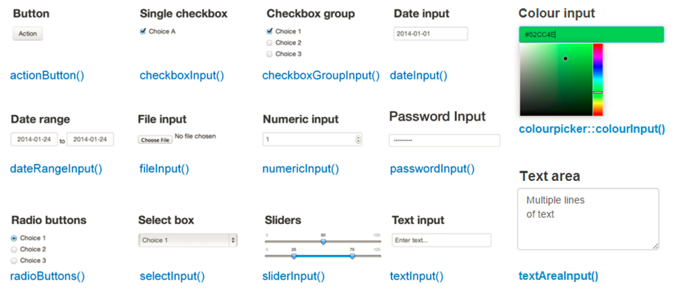

```{r setup, echo = FALSE, message = FALSE, warning = FALSE}
library(shiny)
library(dplyr)
options(dplyr.print_min = 5)
library(knitr)
library(readr)
library(plotly)
library(DT)
opts_chunk$set(echo = FALSE)
```


## What is R Shiny?  

- [R Shiny Package](http://shiny.rstudio.com/)  

    + Developed by RStudio  
    + Allows for creation of apps and dashboards  
  
- Usually a .R file (or two) with special code to create an app  
  
    + `ui.R` (User Interface)  
    + `server.R` (R functions that run/respond to UI)
    + `app.R` (both UI and server combined)  
    
- But you can also just add them to HTML documents  

- Requires no HTML, CSS, or JavaScript!

  
## Example App
```{r eruptions}
inputPanel(
  selectInput("n_breaks", label = "Number of bins:",
              choices = c(10, 20, 35, 50), selected = 20),
  
  sliderInput("bw_adjust", label = "Bandwidth adjustment:",
              min = 0.2, max = 2, value = 1, step = 0.2)
)

renderPlot({
  hist(faithful$eruptions, probability = TRUE, breaks = as.numeric(input$n_breaks),
       xlab = "Duration (minutes)", main = "Geyser eruption duration")
  
  dens <- density(faithful$eruptions, adjust = input$bw_adjust)
  lines(dens, col = "blue")
})
```


## Available Apps  

- Many available resources.  Many have their source code available on github!  

- [Book of Apps for Statistics Teaching (BOAST)](https://sites.psu.edu/shinyapps/)  
- [Stat Concepts](https://github.com/gastonstat/shiny-introstats/)  

- [More Stat Concepts](https://www.researchgate.net/publication/298786680_Web_Application_Teaching_Tools_for_Statistics_Using_R_and_Shiny)  

- [Even more!](http://www.statistics.calpoly.edu/shiny)

- [Shiny Gallery/Showcase](https://shiny.rstudio.com/gallery/)


## Where to Start?

- Learn about user interface (UI) elements  

    + Input widgets (sliders, numeric inputs, etc.)
    + Formatting of text
    + UI layout

- Understand how the server (R) backend works with the UI elements  

    + Accessing UI inputs
    + Creating outputs


## Create a shiny markdown doc

- File --> New file --> R Markdown  

- Really, we just need to add `runtime: shiny` to the YAML header for an HTML doc!  

```{r, echo = FALSE, fig.align='center', out.width="40%"}

```

## Adding Widgets  

  - Widgets can be added using their `*Input` functions  
  - You can just place widgets within an R code chunk!  

```{r, out.width = "85%", fig.align='center'}

```
  

## Widget Example  

```{r, eval = FALSE, echo = TRUE}
numericInput("num", "Enter a Number", value = 0, min = 0, max = 100)
sliderInput("slide", label = "A Slider!", min = 0, max = 1, value = 0.5, step = 0.05)
```

```{r, echo = FALSE}
numericInput("num", "Enter a Number", value = 0, min = 0, max = 100)
sliderInput("slide", label = "A Slider!", min = 0, max = 1, value = 0.5, step = 0.05)
```


## Adding Formatted Text  

Can also add:  

- Any plain strings  
- Formatted text (using HTML type functions)  
```{r, out.width = "85%", fig.align='center'}
knitr::include_graphics("tags.PNG")
```

## Widget & Text Example  

```{r, eval = FALSE, echo = TRUE}
h2("First App title!")
a("RStudio link", href = "https://www.RStudio.com")
numericInput("num", "Enter a Number", value = 0, min = 0, max = 100)
sliderInput("slide", label = "A Slider!", min = 0, max = 1, value = 0.5, step = 0.05)
```

```{r, echo = FALSE}
h2("First App title!")
a("RStudio link", href = "https://www.RStudio.com")
numericInput("num", "Enter a Number", value = 0, min = 0, max = 100)
sliderInput("slide", label = "A Slider!", min = 0, max = 1, value = 0.5, step = 0.05)
```

  
## Formatting  

- `inputPanel()` allows you to add user inputs, text, etc. in a single row  

- Syntax:

`inputPanel(`  
&nbsp;&nbsp;`widgetName1(...),`  
&nbsp;&nbsp;`textFormatting(...),`  
&nbsp;&nbsp;`widgetName2(..),`  
`)`

## Example

```{r, echo = TRUE, eval = FALSE}
h2("First App title!")

inputPanel(
  a("RStudio link", href = "https://www.RStudio.com"),
  numericInput("num", "Enter a Number", value = 0, min = 0, max = 100),
  sliderInput("slide", label = "A Slider!", min = 0, max = 1, value = 0.5, step = 0.05)
)
```

```{r, echo = FALSE}
h2("First App title!")

inputPanel(
  a("RStudio link", href = "https://www.RStudio.com"),
  numericInput("num", "Enter a Number", value = 0, min = 0, max = 100),
  sliderInput("slide", label = "A Slider!", min = 0, max = 1, value = 0.5, step = 0.05)
)
```


## Creating Outputs

- Outputs can be created using their `render*` functions  

```{r, fig.align='center', out.width="60%"}

```


## More About Widgets

- Widgets all follow the same structure

- `widgetName("internalID", label = "Title the user sees", ...)`

- The `internalID` is how you access the inputs when creating plots, summaries, etc.  


## Plot Example

```{r, echo = TRUE, eval = FALSE}
inputPanel(
  checkboxInput("addColor", "Color")
)

renderPlot({
  g <- ggplot(iris, aes(x = Sepal.Length, y = Sepal.Width)) 
  if(input$addColor){
    g + geom_point(aes(color = Species))
  } else {
      g + geom_point()
  }
})
```

## Plot Example 

```{r, echo = FALSE, fig.width=5}
inputPanel(
  checkboxInput("addColor", "Color")
)

renderPlot({
  g <- ggplot(iris, aes(x = Sepal.Length, y = Sepal.Width)) 
  if(input$addColor){g + geom_point(aes(color = Species))} else {g + geom_point()}
})
```


## Quick Sampling Distribution Example

Code to create some samples  

- rows 1:n represents a sample of size n
- each column represents a data set

```{r, echo = TRUE, message = FALSE, warning = FALSE}
simData <- replicate(1000, rexp(n = 50, rate = 1)) %>% 
  as_tibble()
simData
```


## Distribution of $\overline{Y}$ from a RS of Exp(1)  

```{r, echo = TRUE, eval = FALSE}
inputPanel(
  numericInput("sampleSize", label = "Sample Size", 
               min = 2, max = 50, value = 10, step = 1),
  sliderInput("numSamples", label = "Number of Simulations", 
              min = 1, max = 1000, value = 1, step = 1, 
              animate = animationOptions(interval = 325))
)

renderPlot({
      ggplot(simData %>% 
               slice_head(n = input$sampleSize) %>% 
               select(1:input$numSamples) %>% 
               colMeans() %>% 
               as_tibble(), 
             aes(x = value)) + 
        geom_histogram(color = "Blue", size = 2)  
    })
```

## Distribution of $\overline{Y}$ from a RS of Exp(1)  

```{r, echo = FALSE, out.width=4}
inputPanel(
  numericInput("sampleSize", label = "Sample Size", min = 2, max = 50, value = 10, step = 1),
  sliderInput("numSamples", label = "Number of Simulations", min = 1, max = 1000, value = 1, step = 1, animate = animationOptions(interval = 325))
)

renderPlot({
      ggplot(simData %>% 
               slice_head(n = input$sampleSize) %>% 
               select(1:input$numSamples) %>% 
               colMeans() %>% 
               as_tibble(), 
             aes(x = value)) + 
        geom_histogram(color = "Blue", size = 2)  
    })
```

## Much more to learn!

- Stand alone apps  
- Shiny themes
- Dashboards
- UI Layouts  
- Reactive contexts  
- Dynamic UIs
- Hosting an app [https://www.shinyapps.io/](shinyapps.io)


## Elements of an App
  - Each app has two things
    * User Interface (UI) 
    * Server     

## Elements of an App
  - Each app has two things
    * User Interface (UI) 
    * Server     
    
  - UI determines **layout** of app  
      + Sets up widgets (items users can interact with)  


## Elements of an App
  - Each app has two things
    * User Interface (UI) 
    * Server     
    
  - UI determines **layout** of app  
      + Sets up widgets (items users can interact with)  
  
  - Server contains R code to **run for the app**  
      + Can include plots, model fitting, any R code really...  


## Elements of an App
  - Each app has two things
    * User Interface (UI) 
    * Server     
    
  - UI determines **layout** of app  
      + Sets up widgets (items users can interact with)  
  
  - Server contains R code to **run for the app**  
      + Can include plots, model fitting, any R code really...  
    
  - Can do with single file (`app.R`) but we'll use a separate file (`ui.R` and `server.R`)


## Two File Approach    

 - Create folder for each App you create  

 - Each App's folder should have `ui.R` and `server.R` files  
 
 - (If single file, `app.R` in each folder)   
 
 - Can create with File --> New File --> Shiny Web App (Go ahead and make a two file app)


## `ui.R` Basic Layout
```{r basic-ui,eval=FALSE,echo=TRUE}
library(shiny)

ui <- fluidPage(
	titlePanel(), 
	
  sidebarLayout(
    sidebarPanel(#usually widgets
      ),
    mainPanel(#usually output
      )
  )
)
```


## UI Common Layout  
```{r layout,echo=FALSE}
shinyUI(fluidPage(
  titlePanel("title panel"),

  sidebarLayout(
    sidebarPanel( "sidebar panel",br(),"|",
              br(),"|",br(),"|",br(),"|",br(),"|",br(),"|",br(),"V",br(),"Usually User Inputs"),
    mainPanel("main panel content-------------------->",br(),"|",
              br(),"|",br(),"|",br(),"|        Usually Output",br(),"|        that Reacts to User Input",br(),"|",br(),"V")
  )
))
``` 


## `server.R` Basic File  
```{r basic-server,eval=FALSE,echo=TRUE}
library(shiny)

shinyServer(function(input, output, session) {

})
```  


## Running an App  
  - While `ui.R` or `server.R` is your active window, click the **Run App** button  
   
  

## Running an App  
  - While `ui.R` or `server.R` is your active window, click the **Run App** button  
      
  
  - Use `shiny::runApp()` function  
     * ex: `runApp("path/to/ui_or_server_or_app.R")`   


## Running an App  
  - While `ui.R` or `server.R` is your active window, click the **Run App** button  
      
  
  - Use `shiny::runApp()` function  
     * ex: `runApp("path/to/ui_or_server_or_app.R")`   

  - Running App will tie up R console!  
  - End by hitting Esc or closing shiny app  
  
  > - Take a minute and run the template app


## Adding to the UI    
Using a comma to separate items, you can add  

- Any plain strings  
- Widgets  
- Formatted text (using HTML type functions)  
- Output from things created in the `server.R` file  
  
  

## Sharing Between Server and UI  

- Widgets are used to take input from the user  

- Use their values in `server.R`   

- Functions in `server.R` will create output to go in the `ui.R`  

    
## Sharing Between Server and UI  
  

## Adding to the UI - Example Syntax
```{r ui-syntax,echo=TRUE,eval=FALSE}
library(shiny)
ui <- fluidPage(
  sidebarLayout(
    sidebarPanel(
      h2("Widgets/Text"),
      numericInput("NI",label="Intercept",value=10),
      sliderInput("SI",label="Slope",min=-1,max=1,value=0,step=0.1),
      "More text",
      br(),
      a(href="http://www.rstudio.com",target="_blank","Link to RStudio")
    ),
    mainPanel(plotOutput("dataPlot"), #dataPlot is name of "plot" object in server
              textOutput("dataInfo"), #dataInfo is name of "text" object in server
              dataTableOutput("dataTable") #dataTable is name of "data" object in server
    )
  )
)
```

***
```{r,eval=TRUE,echo=FALSE,message=FALSE}
library(shiny)
library(DT)
library(ggplot2)
shinyApp(
  ui <- fluidPage(
    sidebarLayout(
      sidebarPanel(
        h2("Widgets/Text"),
        numericInput("NI",label="Intercept",value=10),
        sliderInput("SI",label="Slope",min=-1,max=1,value=0,step=0.1),
        "More text",
        br(),
        a(href="http://www.rstudio.com",target="_blank","Link to RStudio")
      ),
      mainPanel(plotOutput("dataPlot"), #dataPlot is name of "plot" object in server
                h3(textOutput("dataInfo")), #dataInfo is name of "text" object in server
                dataTableOutput("dataTable") #dataTable is name of "data" object in server
      )
    )
  ),
  shinyServer(function(input, output,session) {
    
    dataSet<-reactive({
      #get inputs
      intercept<-input$NI
      slope<-input$SI
      
      x<-rnorm(100)
      y<-intercept+slope*x+rnorm(100)
      
      data.frame(y=y,x=x)
    })
    
    #create plot
    output$dataPlot<-renderPlot({
      data<-dataSet()
      
      fit<-lm(data$y~data$x)
      p<-ggplot(data=data,aes(x=data$x,y=data$y))+geom_point()+geom_smooth(method=lm)
      p
    })
    
    output$dataInfo<-renderText(paste0("The true intercept is ",input$NI,".  The true slope is ",input$SI,"."))
    
    output$dataTable<-renderDataTable(dataSet())
  })
)
```


## Summary So Far   
`ui.r`    

  - Controls layout of app    

  - Basic layout uses a sidebar panel and a main panel    

  - Use strings, formatted (html style) text, widgets (`*Input` functions), and output from `server.r`  (`*Output` functions)    

  - Separate items with commas      


## Basic UI Exercise


