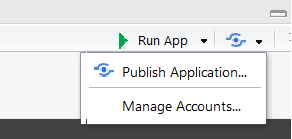

```{r setup, echo = FALSE, message = FALSE, warning = FALSE}
library(shiny)
library(dplyr)
options(dplyr.print_min = 5)
library(knitr)
library(readr)
library(plotly)
library(DT)
opts_chunk$set(echo = FALSE)
```


## What is R Shiny?  

- [R Shiny Package](http://shiny.rstudio.com/)  

    + Developed by RStudio  
    + Allows for creation of apps and dashboards  
  
- Usually a .R file (or two) with special code to create an app  
  
    + `ui.R` (User Interface)  
    + `server.R` (R functions that run/respond to UI)
    + `app.R` (both UI and server combined)  
    
- But you can also just add them to HTML documents  

- Requires no HTML, CSS, or JavaScript!

  
## Example App
```{r eruptions}
inputPanel(
  selectInput("n_breaks", label = "Number of bins:",
              choices = c(10, 20, 35, 50), selected = 20),
  
  sliderInput("bw_adjust", label = "Bandwidth adjustment:",
              min = 0.2, max = 2, value = 1, step = 0.2)
)

renderPlot({
  hist(faithful$eruptions, probability = TRUE, breaks = as.numeric(input$n_breaks),
       xlab = "Duration (minutes)", main = "Geyser eruption duration")
  
  dens <- density(faithful$eruptions, adjust = input$bw_adjust)
  lines(dens, col = "blue")
})
```


## Available Apps  

- Many available resources.  Many have their source code available on github!  

- [Book of Apps for Statistics Teaching (BOAST)](https://sites.psu.edu/shinyapps/)  
- [Stat Concepts](https://github.com/gastonstat/shiny-introstats/)  

- [More Stat Concepts](https://www.researchgate.net/publication/298786680_Web_Application_Teaching_Tools_for_Statistics_Using_R_and_Shiny)  

- [Even more!](http://www.statistics.calpoly.edu/shiny)

- [Shiny Gallery/Showcase](https://shiny.rstudio.com/gallery/)


## Where to Start?

- Learn about user interface (UI) elements  

    + Input widgets (sliders, numeric inputs, etc.)
    + Formatting of text
    + UI layout

- Understand how the server (R) backend works with the UI elements  

    + Accessing UI inputs
    + Creating outputs


## Create a shiny markdown doc

- File --> New file --> R Markdown  

- Really, we just need to add `runtime: shiny` to the YAML header for an HTML doc!  

```{r, echo = FALSE, fig.align='center', out.width="40%"}
knitr::include_graphics("shinyDoc.PNG")
```

## Adding Widgets  

  - Widgets can be added using their `*Input` functions  
  - You can just place widgets within an R code chunk!  

```{r, out.width = "85%", fig.align='center'}
knitr::include_graphics("widgets.PNG")
```
  

## Widget Example  

```{r, eval = FALSE, echo = TRUE}
numericInput("num", "Enter a Number", value = 0, min = 0, max = 100)
sliderInput("slide", label = "A Slider!", min = 0, max = 1, value = 0.5, step = 0.05)
```

```{r, echo = FALSE}
numericInput("num", "Enter a Number", value = 0, min = 0, max = 100)
sliderInput("slide", label = "A Slider!", min = 0, max = 1, value = 0.5, step = 0.05)
```


## Adding Formatted Text  

Can also add:  

- Any plain strings  
- Formatted text (using HTML type functions)  
```{r, out.width = "85%", fig.align='center'}
knitr::include_graphics("tags.PNG")
```

## Widget & Text Example  

```{r, eval = FALSE, echo = TRUE}
h2("First App title!")
a("RStudio link", href = "https://www.RStudio.com")
numericInput("num", "Enter a Number", value = 0, min = 0, max = 100)
sliderInput("slide", label = "A Slider!", min = 0, max = 1, value = 0.5, step = 0.05)
```

```{r, echo = FALSE}
h2("First App title!")
a("RStudio link", href = "https://www.RStudio.com")
numericInput("num", "Enter a Number", value = 0, min = 0, max = 100)
sliderInput("slide", label = "A Slider!", min = 0, max = 1, value = 0.5, step = 0.05)
```

  
## Formatting  

- `inputPanel()` allows you to add user inputs, text, etc. in a single row  

- Syntax:

`inputPanel(`  
&nbsp;&nbsp;`widgetName1(...),`  
&nbsp;&nbsp;`textFormatting(...),`  
&nbsp;&nbsp;`widgetName2(..),`  
`)`

## Example

```{r, echo = TRUE, eval = FALSE}
h2("First App title!")

inputPanel(
  a("RStudio link", href = "https://www.RStudio.com"),
  numericInput("num", "Enter a Number", value = 0, min = 0, max = 100),
  sliderInput("slide", label = "A Slider!", min = 0, max = 1, value = 0.5, step = 0.05)
)
```

```{r, echo = FALSE}
h2("First App title!")

inputPanel(
  a("RStudio link", href = "https://www.RStudio.com"),
  numericInput("num", "Enter a Number", value = 0, min = 0, max = 100),
  sliderInput("slide", label = "A Slider!", min = 0, max = 1, value = 0.5, step = 0.05)
)
```


## Creating Outputs

- Outputs can be created using their `render*` functions  

```{r, fig.align='center', out.width="60%"}
knitr::include_graphics("render.PNG")
```


## More About Widgets

- Widgets all follow the same structure

- `widgetName("internalID", label = "Title the user sees", ...)`

- The `internalID` is how you access the inputs when creating plots, summaries, etc.  


## Plot Example

```{r, echo = TRUE, eval = FALSE}
inputPanel(
  checkboxInput("addColor", "Color")
)

renderPlot({
  g <- ggplot(iris, aes(x = Sepal.Length, y = Sepal.Width)) 
  if(input$addColor){
    g + geom_point(aes(color = Species))
  } else {
      g + geom_point()
  }
})
```

## Plot Example 

```{r, echo = FALSE, fig.width=5}
inputPanel(
  checkboxInput("addColor", "Color")
)

renderPlot({
  g <- ggplot(iris, aes(x = Sepal.Length, y = Sepal.Width)) 
  if(input$addColor){g + geom_point(aes(color = Species))} else {g + geom_point()}
})
```


## Quick Sampling Distribution Example

Code to create some samples  

- rows 1:n represents a sample of size n
- each column represents a data set

```{r, echo = TRUE, message = FALSE, warning = FALSE}
simData <- replicate(1000, rexp(n = 50, rate = 1)) %>% 
  as_tibble()
simData
```


## Distribution of $\overline{Y}$ from a RS of Exp(1)  

```{r, echo = TRUE, eval = FALSE}
inputPanel(
  numericInput("sampleSize", label = "Sample Size", 
               min = 2, max = 50, value = 10, step = 1),
  sliderInput("numSamples", label = "Number of Simulations", 
              min = 1, max = 1000, value = 1, step = 1, 
              animate = animationOptions(interval = 325))
)

renderPlot({
      ggplot(simData %>% 
               slice_head(n = input$sampleSize) %>% 
               select(1:input$numSamples) %>% 
               colMeans() %>% 
               as_tibble(), 
             aes(x = value)) + 
        geom_histogram(color = "Blue", size = 2)  
    })
```

## Distribution of $\overline{Y}$ from a RS of Exp(1)  

```{r, echo = FALSE, out.width=4}
inputPanel(
  numericInput("sampleSize", label = "Sample Size", min = 2, max = 50, value = 10, step = 1),
  sliderInput("numSamples", label = "Number of Simulations", min = 1, max = 1000, value = 1, step = 1, animate = animationOptions(interval = 325))
)

renderPlot({
      ggplot(simData %>% 
               slice_head(n = input$sampleSize) %>% 
               select(1:input$numSamples) %>% 
               colMeans() %>% 
               as_tibble(), 
             aes(x = value)) + 
        geom_histogram(color = "Blue", size = 2)  
    })
```

## Much more to learn!

- Stand alone apps  
- Shiny themes
- Dashboards
- UI Layouts  
- Reactive contexts  
- Dynamic UIs
- Hosting an app [https://www.shinyapps.io/](shinyapps.io)


## Elements of an App
  - Each app has two things
    * User Interface (UI) 
    * Server     

## Elements of an App
  - Each app has two things
    * User Interface (UI) 
    * Server     
    
  - UI determines **layout** of app  
      + Sets up widgets (items users can interact with)  


## Elements of an App
  - Each app has two things
    * User Interface (UI) 
    * Server     
    
  - UI determines **layout** of app  
      + Sets up widgets (items users can interact with)  
  
  - Server contains R code to **run for the app**  
      + Can include plots, model fitting, any R code really...  


## Elements of an App
  - Each app has two things
    * User Interface (UI) 
    * Server     
    
  - UI determines **layout** of app  
      + Sets up widgets (items users can interact with)  
  
  - Server contains R code to **run for the app**  
      + Can include plots, model fitting, any R code really...  
    
  - Can do with single file (`app.R`) but we'll use a separate file (`ui.R` and `server.R`)


## Two File Approach    

 - Create folder for each App you create  

 - Each App's folder should have `ui.R` and `server.R` files  
 
 - (If single file, `app.R` in each folder)   
 
 - Can create with File --> New File --> Shiny Web App (Go ahead and make a two file app)


## `ui.R` Basic Layout
```{r basic-ui,eval=FALSE,echo=TRUE}
library(shiny)

ui <- fluidPage(
	titlePanel(), 
	
  sidebarLayout(
    sidebarPanel(#usually widgets
      ),
    mainPanel(#usually output
      )
  )
)
```


## UI Common Layout  
```{r layout,echo=FALSE}
shinyUI(fluidPage(
  titlePanel("title panel"),

  sidebarLayout(
    sidebarPanel( "sidebar panel",br(),"|",
              br(),"|",br(),"|",br(),"|",br(),"|",br(),"|",br(),"V",br(),"Usually User Inputs"),
    mainPanel("main panel content-------------------->",br(),"|",
              br(),"|",br(),"|",br(),"|        Usually Output",br(),"|        that Reacts to User Input",br(),"|",br(),"V")
  )
))
``` 


## `server.R` Basic File  
```{r basic-server,eval=FALSE,echo=TRUE}
library(shiny)

shinyServer(function(input, output, session) {

})
```  


## Running an App  
  - While `ui.R` or `server.R` is your active window, click the **Run App** button  
   
  

## Running an App  
  - While `ui.R` or `server.R` is your active window, click the **Run App** button  
      
  
  - Use `shiny::runApp()` function  
     * ex: `runApp("path/to/ui_or_server_or_app.R")`   


## Running an App  
  - While `ui.R` or `server.R` is your active window, click the **Run App** button  
      
  
  - Use `shiny::runApp()` function  
     * ex: `runApp("path/to/ui_or_server_or_app.R")`   

  - Running App will tie up R console!  
  - End by hitting Esc or closing shiny app  
  
  > - Take a minute and run the template app


## Adding to the UI    
Using a comma to separate items, you can add  

- Any plain strings  
- Widgets  
- Formatted text (using HTML type functions)  
- Output from things created in the `server.R` file  
  
  

## Sharing Between Server and UI  

- Widgets are used to take input from the user  

- Use their values in `server.R`   

- Functions in `server.R` will create output to go in the `ui.R`  

    
## Sharing Between Server and UI  
  

## Adding to the UI - Example Syntax
```{r ui-syntax,echo=TRUE,eval=FALSE}
library(shiny)
ui <- fluidPage(
  sidebarLayout(
    sidebarPanel(
      h2("Widgets/Text"),
      numericInput("NI",label="Intercept",value=10),
      sliderInput("SI",label="Slope",min=-1,max=1,value=0,step=0.1),
      "More text",
      br(),
      a(href="http://www.rstudio.com",target="_blank","Link to RStudio")
    ),
    mainPanel(plotOutput("dataPlot"), #dataPlot is name of "plot" object in server
              textOutput("dataInfo"), #dataInfo is name of "text" object in server
              dataTableOutput("dataTable") #dataTable is name of "data" object in server
    )
  )
)
```

***
```{r,eval=TRUE,echo=FALSE,message=FALSE}
library(shiny)
library(DT)
library(ggplot2)
shinyApp(
  ui <- fluidPage(
    sidebarLayout(
      sidebarPanel(
        h2("Widgets/Text"),
        numericInput("NI",label="Intercept",value=10),
        sliderInput("SI",label="Slope",min=-1,max=1,value=0,step=0.1),
        "More text",
        br(),
        a(href="http://www.rstudio.com",target="_blank","Link to RStudio")
      ),
      mainPanel(plotOutput("dataPlot"), #dataPlot is name of "plot" object in server
                h3(textOutput("dataInfo")), #dataInfo is name of "text" object in server
                dataTableOutput("dataTable") #dataTable is name of "data" object in server
      )
    )
  ),
  shinyServer(function(input, output,session) {
    
    dataSet<-reactive({
      #get inputs
      intercept<-input$NI
      slope<-input$SI
      
      x<-rnorm(100)
      y<-intercept+slope*x+rnorm(100)
      
      data.frame(y=y,x=x)
    })
    
    #create plot
    output$dataPlot<-renderPlot({
      data<-dataSet()
      
      fit<-lm(data$y~data$x)
      p<-ggplot(data=data,aes(x=data$x,y=data$y))+geom_point()+geom_smooth(method=lm)
      p
    })
    
    output$dataInfo<-renderText(paste0("The true intercept is ",input$NI,".  The true slope is ",input$SI,"."))
    
    output$dataTable<-renderDataTable(dataSet())
  })
)
```


## Summary So Far   
`ui.r`    

  - Controls layout of app    

  - Basic layout uses a sidebar panel and a main panel    

  - Use strings, formatted (html style) text, widgets (`*Input` functions), and output from `server.r`  (`*Output` functions)    

  - Separate items with commas      


## Basic UI Exercise


## Server file  
`server.r` also called the 'back-end' because it works behind-the-scenes; its actions are not directly visible

```{r server-basics, eval=FALSE,echo=TRUE}
## set up server
shinyServer(function(input, output, session) {
  # add stuff
})
```


## Server file  
`server.r` also called the 'back-end' because it works behind-the-scenes

```{r server-basics2, eval=FALSE,echo=TRUE}
## set up server
shinyServer(function(input, output, session) {
  # add stuff
})
```

The arguments for the server are `input`, `output`, and `session`.  Allow us to    

  1. Take in inputs from the UI        
  
  2. Run functions on them     
  
  3. Create outputs to send back     
  

## Creating Output to Send to UI  
  


## Creating Output to Send to UI
Example syntax
```{r server-syntax,echo=TRUE,eval=FALSE}
shinyServer(function(input,output){
  output$nameOfOutputObject <- renderPlot(
    #code that will return a plot
  )
  
  output$otherOutput <- renderText(
    #code that will return something that R can coerce to a string
  )
})

#in ui.r file, reference would look like
plotOutput("nameOfOutputObject")
textOutput("otherOutput")
```

## Accessing Input Values in server.R
 - Every input object has an `inputId`


## Accessing Input Values in server.R
 - Every input object has an `inputId`
 - In `server.r`, reference input value by
```{r input-ref,echo=TRUE,eval=FALSE}
input$inputId
```


## Accessing Input Values in server.R
 - Every input object has an `inputId`
 - In `server.r`, reference input value by
```{r input-ref2,echo=TRUE,eval=FALSE}
input$inputId
```
 - Example
```{r input-ref-ex,echo=TRUE,eval=FALSE}
#input widget code from ui.r file
sliderInput(inputId = "slide",label = "Select the Range Here",min = 0,max = 1,
            value = c(0,1))
#reference in server.r might look like
output$userPlot<-renderPlot({
  range<-input$slide
  #create plot that changes based on user input
  plot(data,xlim=range)  
})
```  


## Input and Output  
 -  `input` and `output` objects are kind of like **lists**  
 -  Shiny passes the information back and forth through them  


## Input and Output  
 -  `input` and `output` objects are kind of like **lists**  
 -  Shiny passes the information back and forth through them  
 -  Notice how we name our output objects  
```{r naming,echo=TRUE,eval=FALSE}
output$nameOfOutputObject <- renderPlot(...)  
```    


## Input and Output  
 -  `input` and `output` objects are kind of like **lists**  
 -  Shiny passes the information back and forth through them  
 -  Notice how we name our output objects  
```{r naming2,echo=TRUE,eval=FALSE}
output$nameOfOutputObject <- renderPlot(...)  
```    
 - Notice how we access our inputs
```{r accessing,echo=TRUE,eval=FALSE}
output$nameOfOutputObject <- renderPlot(
   range <- input$slide
   ...
)  
```    


## Quick Try  

- Using the template app  

- Add text output object in the `server.R` file (use `renderText()`) that returns the current value of the input slider   

- To do this, just reference the input (like an R function, it will return the last thing you do)  

- Add a `textOutput()` in the `ui.R` file!  


## Reactivity  
 - Output objects do not have to depend on an input    

 - Those that don't will be static    
 
> - Any 'chunk' of code in `server.r` that references a user input must be **reactive**   

> - When a user changes an input the `input$` value associated invalidates and causes appropriate chunks of code to **re-evaluate** in the server  

## Example Reactivity
```{r reactivity,echo=TRUE,eval=FALSE}

##code chunk "reacts" to and re-evaluates if 
##input$sampleSize or input$otherInput changes 

output$dataPlot <- renderPlot({

  n <- input$sampleSize
  input$otherInput #not used anywhere else, but entire   
                   #renderPlot chunk still re-evaluates
                   #if changed
  
  hist(rbinom(n = 1, size = n, prob = 0.4))
  
})
```

- type `shiny::runExample("01_hello")` into the console


## Reactivity  

- `server.r` can run any R code, but can't access inputs unless put into a reactive context     

- All `render*` functions are reactive contexts    

 
## Error Using Reactive Variables  
Following returns the error:

```{r bad-reactivity,echo=TRUE,eval=FALSE}
shinyApp(ui <- fluidPage(
                numericInput("NI", "Give me a number", value = 10),
                textOutput("string")
                ),
         
         shinyServer(function(input, output){
                print(input$NI + 10)
                output$string <- renderText(paste("value plus 10 is", input$NI + 10))
         }
))
```
Warning: Error in .getReactiveEnvironment()$currentContext: Operation not allowed without an active reactive context. (You tried to do something that can only be done from inside a reactive expression or observer.)  


## Other Reactive Contexts  

- `reactive({})` creates a reactive context and allows for the creation of a new variable  

- `reactiveValues({})` similar to `reactive` but is easier to create multiple items  

- `observe({})` function allows for reactivity and reevaluation of code  

- `observeEvent({})` similar to observe but allows for more control  

- `eventReactive({})` similar to `observeEvent()` but you can return something like `reactive()` does  
 

## More on `reactive({})`

  - 'Wraps' a normal expression to create a reactive expression (code user can cause to change)     
  
 > - Can read reactive values and call other reactive expressions    
 
 > - Usually used to save something you'll call in multiple other places  
 
 > - Access object as though calling it as a function  


## More on `reactive({})`

- Access object as though calling it as a function  
  
```{r reactive,echo=TRUE,eval=FALSE}
shinyServer(function(input,output){
  #Creates a new reactive variable
  newVar <- reactive({
    value <- c(input$NI + 10, input$NI * 3)
  })

  output$textString <- renderText({
    value <- newVar()  #access like a function!
    paste0("Input plus 10 is ", value[1], " and Input times 3 is ", value[2])
  })
  
  output$otherString <- renderText({
  	value <- newVar()
  	paste0(value[1], ",", value[2])
  })
})
```


## `reactiveValues()`  

- Create list like object with `reactiveValues()`  

- Access elements via `$` 

- Elements can be changed in a reactive context    

```{r reactiveValues,echo=TRUE,eval=FALSE}
shinyServer(function(input,output){
  #Creates a new reactive values
  vals <- reactiveValues(data = rnorm(150), initial = 0)

  output$textString <- renderText({
    paste0("The value of initial is ", vals$initial)
  })
  
  output$hist <- renderPlot({
    hist(vals$data)
  })
})
```

## `observe({})`  

  - Can read reactive values and call reactive expressions    

>  - Doesn't yield a result - just re-executes the code

```{r correct-reactivity,echo=TRUE,eval=FALSE}
shinyServer(function(input,output){
  #would now print to console
  observe({print(input$NI+10)})

	#update UI
	observe({
		input$noPitch
		updateCheckboxGroupInput(session, "pitchTypeChoice", selected = c(""))
	})
})
```  

## `observeEvent({})`  

  - Similar to observe but allows for control of dependencies  
  
  - Place explicit dependencies prior to `{}`  

```{r correct-reactivity2,echo=TRUE,eval=FALSE}
shinyServer(function(input,output){
  #would now print to console
  observeEvent(input$NI, {print(input$data)})

	#update UI
	observe({
		input$noPitch
		updateCheckboxGroupInput(session, "pitchTypeChoice", selected = c(""))
	})
})
```  


## `eventReactive()`  

- Similar to `observeEvent()` but returns object similar to `reactive()` (use like a function)  

```{r, echo = TRUE}
shinyServer(function(input,output){
  #would now print to console
  update <- eventReactive(input$submit, {list(gamma = input$gamma, alpha = input$alpha)})

	#update UI
	output$gammaDist <- renderText({
	  paste0("The parameters are ", update())
	})
})
```


## Quick Try  

- Continue building from the template app  

- Add two `numericInput()` elements and an `actionButtion()`  

- Create a `reactive()` object that uses the number inputs and the slider value  

- Use this object in the previous `renderText()` and output a new table (add this in UI as well)  

- Use `observeEvent()` to print something to the console only when the action button is pressed  

- Use `eventReactive()` to change some output only when the action button is pressed


## Developing an App

- **Highly Recommended:** 

Draw out what you want the app to look like    

- Write R code to complete your app in a static manner!  

- Determine dependencies and consider reactive functions to use  

- Translate to appropriate Shiny output functions


## Summary So Far   
`ui.r`    

  - Controls layout of app    
  - Basic layout uses a sidebar panel and a main panel    
  - Use strings, formatted (html style) text, widgets (`*Input` functions), and output from `server.r`  (`*Output` functions)    
  - Separate items with commas      
  
`server.r`    

  - Back-end for app      
  - Create outputs that react to inputs (`render*` functions)      
  - To respond to input, must be in a reactive context      


##  Dynamic UI  
  
  - Often want to update UI based on user input!  

 > - Methods for updating UI  
     <ul>  
         <li> `update*` functions</li>  
         <li> `renderUI()`/`uiOutput()`</li>
         <li> `conditionalPanel()`</li>  
      </ul>  
      
      
##  Using update* Functions  

  - Every input widget has a corresponding update function  
    + `updateActionButton()`  
    + `updateCheckboxInput()`  
    + `updateNumericInput()`  
    + ...
 
## Using update* Functions  

  - Every input widget has a corresponding update function  
    + `updateActionButton()`  
    + `updateCheckboxInput()`  
    + `updateNumericInput()`  
    + ...
    
  - Require session argument on server() function  
```{r session,echo=TRUE,eval=FALSE}
shinyServer(function(input, output, session) {
  ##  do stuff
})
```  

## Using update* Functions  

  - Every input widget has a corresponding update function  
    + `updateActionButton()`  
    + `updateCheckboxInput()`  
    + `updateNumericInput()`  
    + ...
    
  - Require session argument on server() function  
```{r session2,echo=TRUE,eval=FALSE}
shinyServer(function(input, output, session) {
  ##  do stuff
})
```  
  - After all observers (reactive things) evaluate, updater sends message back to client


## Using update* Functions

  - Syntax of `update*` functions similar to the functions that created the inputs
  
Example syntax:  

```{r update, echo = TRUE, eval = FALSE}
numericInput(inputId, label, value, min = NA, max = NA, step = NA,
  width = NULL)

updateNumericInput(session, inputId, label = NULL, value = NULL,
  min = NULL, max = NULL, step = NULL)  
```  


## Using update* Functions

  - Syntax of `update*` functions similar to the functions that created the inputs
  
Example syntax:  

```{r update2, echo = TRUE, eval = FALSE}
numericInput(inputId, label, value, min = NA, max = NA, step = NA,
  width = NULL)

updateNumericInput(session, inputId, label = NULL, value = NULL,
  min = NULL, max = NULL, step = NULL)  
```  

  - Any arguments with `NULL` values ignored (i.e. will not result in any changes to the input object)

>  - For `radioButtons()`, `checkboxGroupInput()`, and `selectInput()`, the set of choices can be cleared by using `choices = character(0)` (similary for the set of selected)

## Using `update*` Functions  
```{r update-ftns, eval = TRUE, echo = FALSE}
library(shiny)
shinyApp(
  # Define UI for application that draws a histogram
  ui <- fluidPage(
     # Application title
     titlePanel("Old Faithful Geyser Data"),
     # Sidebar with a slider input for number of bins 
     sidebarLayout(
        sidebarPanel(
           sliderInput("bins", 
                       "Number of bins:", 
                       min = 1, 
                       max = 50, 
                       value = 30), 
           numericInput("maxBins",label="Set Maximum Number of Bins", value = 50, min = 1, max = 100)
        ),
        # Show a plot of the generated distribution
        mainPanel(
           plotOutput("distPlot")
        )
     )
  ),
  # Define server logic required to draw a histogram
  server <- function(input, output, session) {
     output$distPlot <- renderPlot({
        # generate bins based on input$bins from ui.R
        x    <- faithful[, 2] 
        bins <- seq(min(x), max(x), length.out = input$bins + 1)
        
        # draw the histogram with the specified number of bins
        hist(x, breaks = bins, col = 'darkgray', border = 'white')
     })
     
     observe({updateSliderInput(session,"bins",max=input$maxBins)})
  }
)
```  

## `updateSliderInput()` (First Attempt)
```{r updateslider,eval=FALSE,echo=TRUE}
  ui <- fluidPage(
        ...
        sidebarPanel(
           sliderInput("bins", "Number of bins:", 
                       min = 1, max = 50, value = 30),
           numericInput("maxBins", label = "Set Maximum Number of Bins",
                        value = 50, min = 1, max = 100)
        ),
        ...
  ),
  server <- function(input, output, session) {
      ...
      updateSliderInput(session, "bins", max = input$maxBins)
  }
)
```  
What is our issue?

## `updateSliderInput()` (Fixed)
```{r updateslider2,eval=FALSE,echo=TRUE}
  ui <- fluidPage(
        ...
        sidebarPanel(
           sliderInput("bins", "Number of bins:",
                       min = 1, max = 50, value = 30),
           numericInput("maxBins", label = "Set Maximum Number of Bins",
                        value = 50, min = 1, max = 100)
        ),
        ...
  )
  server <- function(input, output, session) {
      ...
      observe({updateSliderInput(session, "bins", max = input$maxBins)})
  }
``` 

## `update*` UI Functions  

 - Use the template app  
 
 - Try to add a numeric input for the user to specify the largest value of the slider  
 
 - Use the `updateSliderInput` function to update the max of the slider  
 
 - Don't forget `observe`!  
 
 - Then, add an `actionButton` to only update when pressed (so no intermediate updates while typing)  
  
 

## `renderUI()` and `uiOutput()`  

  - Alternatively, `renderUI()` and `uiOutput()` can be used  


## `renderUI()` and `uiOutput()`  

  - Alternatively, `renderUI()` and `uiOutput()` can be used  
  - Shiny essentially writes HTML/JavaScript for us!
```{r html,echo=TRUE,eval=TRUE}
print(fluidPage(titlePanel(title = "Hi"),
                sidebarLayout(sidebarPanel(), mainPanel())))
```


## `renderUI()` and `uiOutput()`  

  - Alternatively, `renderUI()` and `uiOutput()` can be used  
  - Shiny essentially writes HTML/JavaScript for us!
```{r html2,echo=TRUE,eval=TRUE}
print(numericInput("id", "Label User Sees", value = 10))
```

## `renderUI()` and `uiOutput()`  

`renderUI()`    
  
 + Makes a **reactive version** of a function that generates HTML (like any widget)
      
> + Have `renderUI()` return a shiny 'tag object,', HTML, or a list of these    
<br>
<br>
> + Use with `uiOutput()` in UI file     

> + Interprets the HTML and outputs appropriately (usually a `div` element)  


## `renderUI()` and `uiOutput()` (updating a widget)  

```{r renderui-widget,eval=FALSE,echo=TRUE}
  ui <- fluidPage(
        ...
        sidebarPanel(
            uiOutput("slider"),
            numericInput("maxBins", label = "Set Maximum Number of Bins",
                         value = 50, min = 1, max = 100)
        ),
        ...
  ),
  server <- function(input, output, session) {
      ...
      output$slider <- renderUI({
          sliderInput("bins", "Number of bins:", min = 1,
                      max = input$maxBins, value = 30)
      })
  }
``` 

## `renderUI()` and `uiOutput()` (outputting HTML)  

```{r renderui-info,eval=FALSE,echo=TRUE}
  ui <- fluidPage(
        ...
        sidebarPanel(
             uiOutput("info"),
             numericInput("purchase", label = "How Many?",
                          value = 50, min = 0, max = 100)
        ),
        ...
  ),
  server <- function(input, output, session) {
      ...
        output$info <- renderUI({
          text <- paste0("You have selected to buy ", input$purchase)
          h3(text)
        })
  }
``` 

## `renderUI()` and `uiOutput()`  

```{r renderui-ex,eval=TRUE,echo=FALSE}
library(shiny)

shinyApp(
  # Define UI for application that draws a histogram
  shinyUI(fluidPage(
    
    # Application title
    titlePanel("Graph is Meaningless Here!"),
    
    # Sidebar 
    sidebarLayout(
      sidebarPanel(
         uiOutput("info"),
         numericInput("purchase",label="How Many?",
                      value=50,min=0,max=100)
      ),
      
      # Show a plot of the generated distribution
      mainPanel(
         plotOutput("distPlot")
      )
    )
  )),
  shinyServer(function(input, output,session) {
   
    output$distPlot <- renderPlot({
  
      # draw the histogram with the specified number of bins
      hist(rnorm(input$purchase), col = 'darkgray', border = 'white')
      
    })
    
    output$info<-renderUI({
      text<-paste0("You have selected to buy ",input$purchase)
      h3(text)
    })

  })
)
```


## `renderUI()` and `uiOutput()`   

- Use the template app  

- Try to add some dynamic updating text to the UI  


## `conditionalPanel()`  

  - Create a 'panel' that is only visible if a condition is met  

 > - Condition can depend on input or output value   
 
 > - Accessed differently!  (Use a '.' not a '$')  


## `conditionalPanel()`  

```{r cond-panel-ex,echo=FALSE,eval=TRUE,message=FALSE}
library(shiny)
library(ggplot2)
library(dplyr)
data2<-filter(diamonds,(diamonds$depth>55)&(diamonds$depth<70))
shinyApp(
  # Define UI for application that draws a histogram
  shinyUI(fluidPage(
    
    # Application title
    titlePanel("Plots of Diamonds Data"),
    
    # Sidebar with a slider input for number of bins 
    sidebarLayout(
      sidebarPanel(
        selectInput("plotType", "Plot Type",
                    c(Scatter = "scatter",Histogram = "hist")),
        
        # Only show this panel if the plot type is a histogram
        conditionalPanel(condition = "input.plotType == 'hist'",
                         selectInput("breaks", "Breaks",
                                     c("Sturges","Scott","Freedman-Diaconis","[Custom]" = "custom")),
                         
           # Only show this panel if Custom is selected
          conditionalPanel(
            condition = "input.breaks == 'custom'",
            sliderInput("breakCount", "Break Count", min=1, max=200, value=40)
          )
        )
      ),
      
      # Show a plot of the generated distribution
      mainPanel(
         plotOutput("distPlot")
      )
    )
  )),
  # Define server logic required to draw a histogram
  shinyServer(function(input, output,session) {
     
    output$distPlot <- renderPlot({
  
      #depending on plot type create hist or scatterplot
      if(input$plotType=="scatter"){
        plot(x=data2$carat,y=data2$depth,xlab="Carat",ylab="Depth")
      } else {
        if(input$breaks=="custom"){
          hist(data2$depth,breaks=input$breakCount)
        } else {
          hist(data2$depth,breaks=input$breaks,xlab="Depth")
        }
      }
  
    })
    
  })
)
```
  
## `conditionalPanel()`  
```{r cond-panel-syntax,echo=TRUE,eval=FALSE}
...
sidebarPanel(
  selectInput("plotType", "Plot Type",
            c(Scatter = "scatter", Histogram = "hist")),
  
  # Only show this panel if the plot type is a histogram
  conditionalPanel(condition = "input.plotType == 'hist'",
          selectInput("breaks", "Breaks",
               c("Sturges", "Scott", "Freedman-Diaconis", "[Custom]" = "custom")),
                       
      # Secondary conditonalPanel, Only show this panel if Custom is selected
      conditionalPanel(
          condition = "input.breaks == 'custom'",
          sliderInput("breakCount", "Break Count", min = 1, max = 200, value = 40)
      )
  )
)
```

## `conditionalPanel()`  

- Use the template app  

- Try to add a new UI element if a condition on the slider is met  


## Dynamic UI Recap  
  
- Often want to update UI based on user input!  
  
- Recall:  UI and server basically pass lists back and forth  

- Methods for updating UI  
    + `update*` functions  
    + `renderUI()`/`uiOutput()`  
    + `conditionalPanel()`  

 
 

## Custom UI Layout  
  - Contents of UI wrapped in `fluidPage()`  
  
> - Content can be wrapped in `fluidRow()`'s  
  
> - Columns can be created with `column(width, offset)` 
  
> - Columns should sum to 12 in total width for an 'area'!
    

## Customized Layout
```{r custom-layout,eval=TRUE,echo=FALSE}
shinyUI(fluidPage(
  fluidRow(
    column(2,"fluidRow with columns-----------------------------------------------------------------------"),
    column(6,"2nd column------------------------------------------------------------------------------------------------------------------------"),
    column(4,"column widths in a given row should add to 12-------------------------------------------------------------")),
  fluidRow(tags$hr()),
  fluidRow(
    column(6,"2nd fluidRow below above row--------------------------------------------------------------------------------------------"),
    column(6,
           fluidRow("Columns can contain their own fluidRow as well, allowing for a lot of customization of layouts!"),
           fluidRow(
             column(3,"subcol --------------------------------------------"),
             column(9,"subcol ----------------------------------------------------------------------------------------------------------------")
           ))
  )
))
```  


***  
```{r custom-layout2,eval=FALSE,echo=TRUE}
shinyUI(fluidPage(
  fluidRow(
    column(2,"fluidRow with columns--------...---------"),
    column(6,"2nd column------------...--------"),
    column(4,"column widths in a given row must add to 12------...---------")),
  fluidRow(tags$hr()),
  fluidRow(
    column(6,"2nd fluidRow below above row----...-----"),
    column(6,
           fluidRow("Columns can contain their own fluidRow as well, allowing for a lot of customization of layouts!"),
           fluidRow(
             column(3,"subcol ----...-----"),
             column(9,"subcol ----...-----")
           ))
  )
))
```
	
## More customization  

- Can wrap UI elements with `wellPanel()`  

    + Puts elements together in grey area  
    
    
## More customization  

- Can wrap UI elements with `wellPanel()`  

    + Puts elements together in grey area  
    
- `tabPanel()` is like a UI page of its own  

    + Used with `tabsetPanel()` or `navbarPage()`  

`    tabsetPanel(`  
`            tabPanel("Title1", "contents"),`  
`            tabPanel("Title2", "contents")`  
`)`  
    
## More customization  

- `navbarMenu()`  

- `navlistPanel()` 	

- `fixedPanel()`  

- `fixedrow()`


## Quick Try  

- Let's use `wellPanel()`, `fluidRow()`, and `columns()`

- Recreate side-bar layout


## Recap  
`ui.r`   

  - Controls layout of app (can use standard layouts or customize)  
  - Use strings, formatted (html style) text, widgets (`*Input` functions), and output from `server.r`  (`*Output` functions)  
  - Separate items with commas  
  - Update inputs, render HTML reactively, conditionally show input  
  
`server.r`  

  - Back-end for app  
  - Create outputs that react to inputs (`render*` functions)  
  - To respond to input, must be in a reactive context  
  - Code can be included prior to `shinyServer()`  
  
## Sharing App  
  - Running App locally ties up your system  
  - Others can't access it!  
  - Can host as a URL on a shiny server  
  - Can host apps on [shinyapps.io (powered by RStudio)](https://shiny.rstudio.com/articles/shinyapps.html)    
    + Free, but number of connects and hours limited  
    + Gives stats about usage  
    + Integrated into R Studio  

     


##  Sharing App

 - Can host files on gitHub and run locally from there using  
 
 `shiny::runGitHub("<your repository name>", "<your user name>")`  
 
 - Can host at a URL and run using `shiny::runURL("<the weblink>")`  
 
 - More info about hosting via a URL or just posting files [here](https://shiny.rstudio.com/tutorial/written-tutorial/lesson7/)


##  Useful Things (Static Code)

Code can be placed prior to shinyServer

```{r common-code,eval=FALSE,echo=TRUE}
## Code here that you only need to evaluate once.
## This can include reading in data, creation of 
##      functions common to all sessions, and 
##      reading of other common r scripts. 

shinyServer(function(input, output) {
  
## Code here that can be reactive.  Differs for 
##      every instance of your app that runs.

})
```


##  Useful Things (Static Code)

**Including Other Files**  
```{r include-files, eval=F,echo=TRUE}
##  top of server.R, output from here is common to all users

#data set only read in once
dat <- read_csv("dataset.csv")

#function created and not modified
helper <- function(item1, item2) {item1 + item2}

shinyServer(function(input, output) {
  ## reactive things, instance of app dependent
})
```


##  Useful Things (Static Code)

**Including Other Files**  

If you have a lot of code, you can read in a separate script   


##  Useful Things (Static Code)

**Including Other Files**  

If you have a lot of code, you can read in a separate script   

 - If external script is `helpers.R` in same folder as app:  
 
```{r source, eval=F,echo=TRUE}
##  top of server.R
source("helpers.R")

shinyServer(function(input, output) {
  ##  do stuff
})
```  


## Improve Efficiency 

  - Can use `isolate()` to improve code efficiency  
```{r isolate,echo=TRUE,eval=FALSE}
renderPlot({
         input$submit  # Do take a dependency on input$submit
         hist(data, breaks = isolate(input$slider)) #don't depend on slider
})
```

## Missing data or object  

- Used to need to check if data/object existed and return `NULL` from your `render*` function  

- Now can use `req()` to check (see [this page](https://shiny.rstudio.com/articles/req.html) for more info)

```{r, echo = TRUE, eval = FALSE}
data <- reactive({
  req("input$dist")
  if(input$dist == "norm"){
    dataVals <- rnorm(100)
  } else if (input$dist == "unif"){
    dataVals <- runif(100)
  }
})

output$plot <- renderPlot({
  hist(data())
})
```

## More Interactive Plots & Math  

  - Improved plots with `plotly` package!  
  - [plotly example](http://shiny.stat.ncsu.edu/jbpost2/Transform/)  
  

## More Interactive Plots & Math  

  - Improved plots with `plotly` package!  
  - [plotly example](http://shiny.stat.ncsu.edu/jbpost2/Transform/)  
  
  - Can add in Latex easily!  
  
  - Include `withMathJax()` as a UI argument   

  - Calls in javascript that will replace Latex source code  

```{r withMathJax,echo=TRUE,eval=FALSE}
fluidRow(
    #add in latex functionality if needed
    withMathJax(),
          ...
```


## Other Useful Things  

  - Create "dashboards" with `shinydashboard` package  
  
  - Alternatively can use `flexdashboard` (doesn't use bootstrap 3 but css flexbox layout)  
  

## Other Useful Things  

  - Create "dashboards" with `shinydashboard` package  
  
  - Alternatively can use `flexdashboard` (doesn't use bootstrap 3 but css flexbox layout)  
  
&nbsp;  &nbsp;    
 
  - Use mouse over and click inputs    
  - [Click Input Example](http://shiny.stat.ncsu.edu/jbpost2/BasketballCharting)
  
  
## Other Useful Things  

  - Create "dashboards" with `shinydashboard` package  
  
  - Alternatively can use `flexdashboard` (doesn't use bootstrap 3 but css flexbox layout)  
  
&nbsp;  &nbsp;    
 
  - Use mouse over and click inputs    
  - [Click Input Example](http://shiny.stat.ncsu.edu/jbpost2/BasketballCharting)
  
&nbsp;  &nbsp;  

 - Include Shiny in your Markdown slides!  
 - Use ioslides and add `runtime: shiny`

  
## Other Useful Things  

  - [shinythemes](https://rstudio.github.io/shinythemes/) are available  
  - [shinyjs package](https://github.com/daattali/shinyjs) adds more functionality  
  - List of [all functions](https://shiny.rstudio.com/reference/shiny/latest/) for the UI and server  
  - Lots of good tutorials!  
    + See weekly overview  
  - [R Shiny Cheat Sheet](http://shiny.rstudio.com/images/shiny-cheatsheet.pdf)


## Debugging  

  - Much harder in shiny!  
  
  - [Shiny debugging page](https://shiny.rstudio.com/articles/debugging.html)  

  - Recommendation: Get static working code, then transfer to shiny  


## Debugging

  - Can use `observe({print(...)})`  

```{r,echo=TRUE,eval=FALSE}
shinyServer(function(input,output){

  #would now print to console
  observe({print(input$NI + 10)})

}
```  

## Debugging  

Three major approaches:  

  1. Breakpoints - Pausing execution of your program

  2. Tracing - Collecting information as your program runs

  3. Error handling - Finding the source of errors (both on the client and server side) and ascertaining their cause.  
  
## Breakpoints  
  - Can be used in `server.r`  
  - Click to the left of the line number  
    

 > - Now can access values and step through program  

 > - Can also use browser()
  
## Tracing  
  - Can run apps in ['showcase mode'](http://shiny.rstudio.com/gallery/kmeans-example.html)      
  - Invoke your app with the code below  
  
```{r,echo=TRUE,eval=FALSE}
shiny::runApp(app, display.mode="showcase")
```

  - Also a reactive log that can be viewed  
  
## Error Handling  
  - Check stack trace shiny returns

  

## Enter Debug Mode on Error  
  - Can make Shiny enter the debugger when an error occurs by using the following statement:  

```{r,echo=TRUE,eval=FALSE}
options(shiny.error = browser)
```  

  - Overall, experience helps!    
  

##  Recap  

- Shiny a great way to share results  

- `ui.R` and `server.R` files or one file using `app.R`  

- Reactive contexts important  

- Can make UI dynamic  

- Deploy in multiple ways  

- Lots of add-ons/packages to make things nicer  

- Debugging can be tricky, best to make static code work first!  
